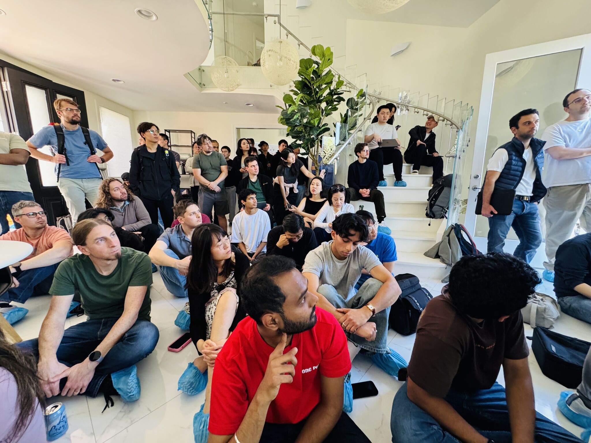
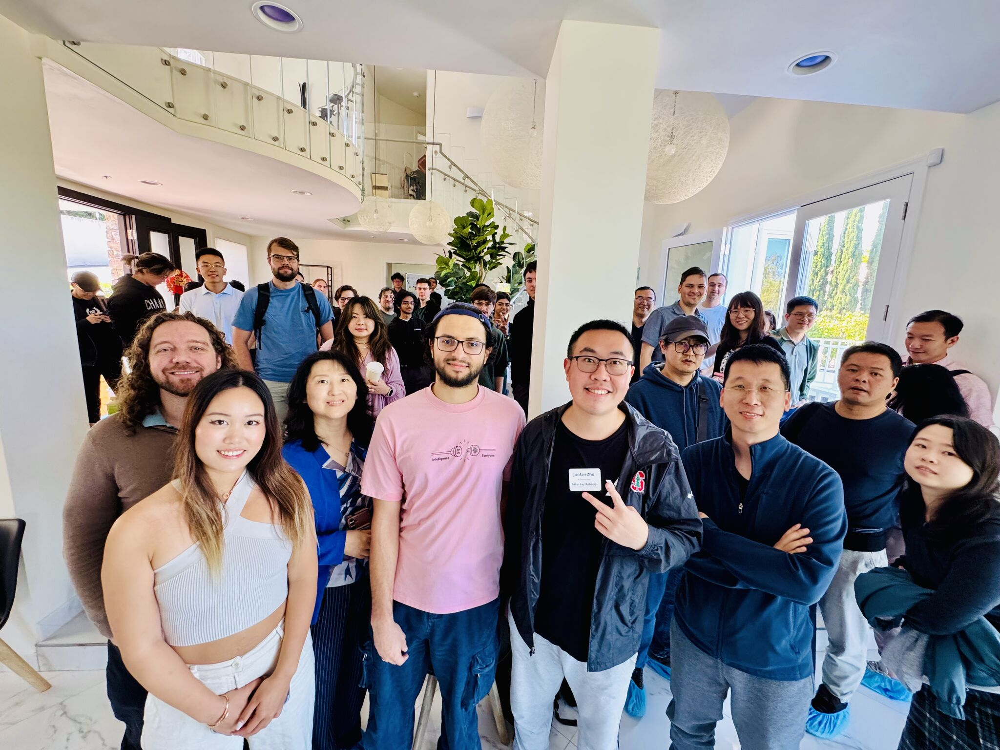
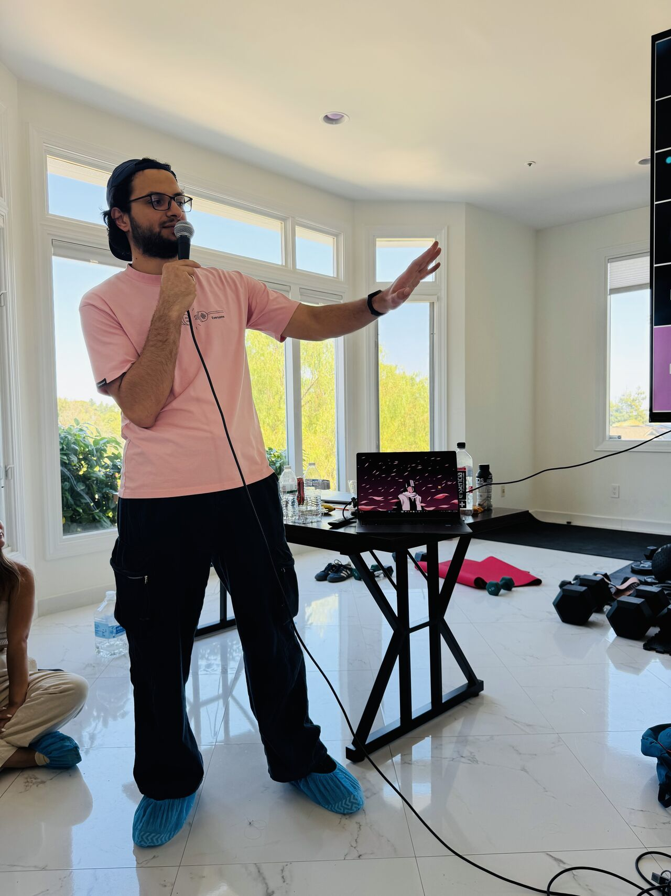
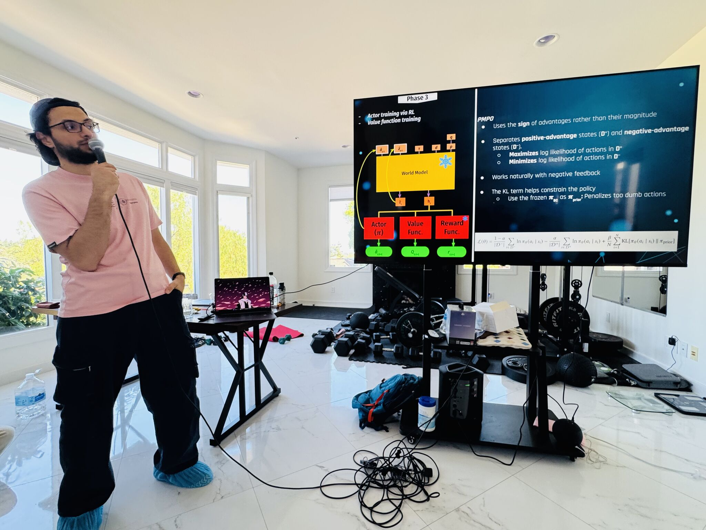
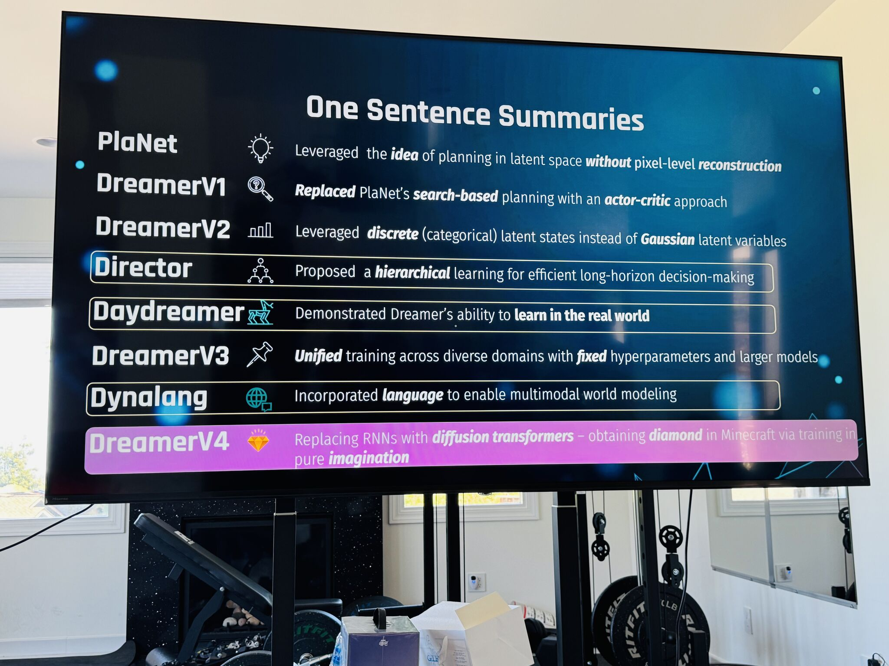


Slides from my keynote at Robotics & World Models Reading Club 07, hosted by Saturday Robotics in Los Altos. The talk follows the Dreamer lineage from latent planning in PlaNet to scalable generative world models for control in DreamerV4.


[Event page](https://luma.com/srhe0vuo) · [Open slides](https://docs.google.com/presentation/d/e/2PACX-1vRWdBhnX4PpXrobAm5XCDtcUzMsk93O-T7p75UlqB0C5h_mqGDZ5pBOF8Qb9HnxRRFJuGUnefUzRHob/pub?start=false&loop=false&delayms=60000) · [Download the PDF](dreamer-v4-reading-club-07.pdf)



## Core Thread

The Dreamer family is built around a simple but powerful idea: learn a compact model of the world, then train behavior inside that learned model instead of relying only on direct environment interaction.

PlaNet showed that planning directly in latent space could work. DreamerV1 replaced search-time planning with actor-critic learning in imagination. DreamerV2 stabilized the recipe with discrete latent states. DreamerV3 scaled the method across diverse domains with fixed hyperparameters. DreamerV4 pushes the framing further: the world model starts to look less like a small RL component and more like a scalable generative foundation model for control.

## Key Takeaways

- DreamerV4 shifts the center of gravity from online RL toward offline world-model pretraining, behavior cloning, and RL inside the learned simulator.
- The architecture moves beyond classic RSSM-style recurrent models by using high-capacity tokenizer and diffusion transformer components.
- Minecraft is a useful stress test because diamond collection requires long-horizon, multi-stage behavior from raw pixels.
- The biggest open problems are still long-horizon consistency, memory, grounding, and reliable transfer from imagined rollouts to real-world control.

## Discussion Questions

- How should online interaction be integrated after large-scale offline world-model pretraining?
- What form of memory is needed for imagined rollouts that span minutes, hours, or days rather than seconds?
- Are world models becoming robot foundation models, or are they still missing the grounding needed for deployment?
- How much real robot data is required before this recipe becomes useful beyond games and simulators?

## References

- Ha and Schmidhuber, [World Models](https://arxiv.org/abs/1803.10122)
- Hafner et al., [Learning Latent Dynamics for Planning from Pixels](https://arxiv.org/abs/1811.04551)
- Hafner et al., [Dream to Control: Learning Behaviors by Latent Imagination](https://arxiv.org/abs/1912.01603)
- Hafner et al., [Mastering Atari with Discrete World Models](https://arxiv.org/abs/2010.02193)
- Hafner et al., [Mastering Diverse Domains through World Models](https://arxiv.org/abs/2301.04104)
- Hafner et al., [Training Agents Inside of Scalable World Models](https://arxiv.org/abs/2509.24527)

## Event Photos




