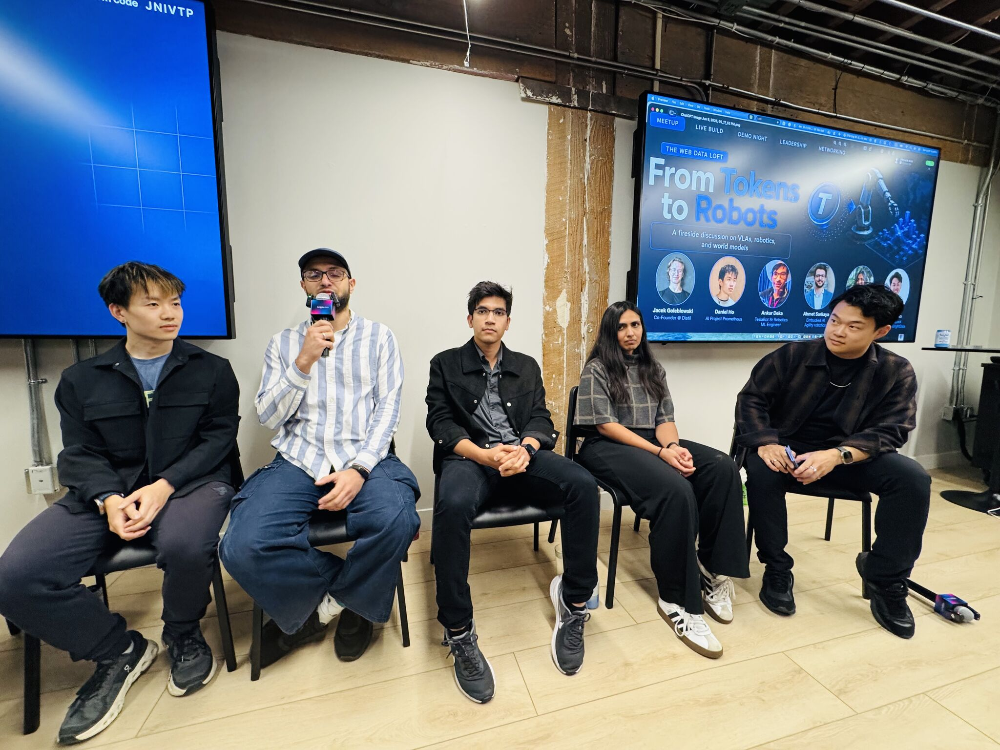
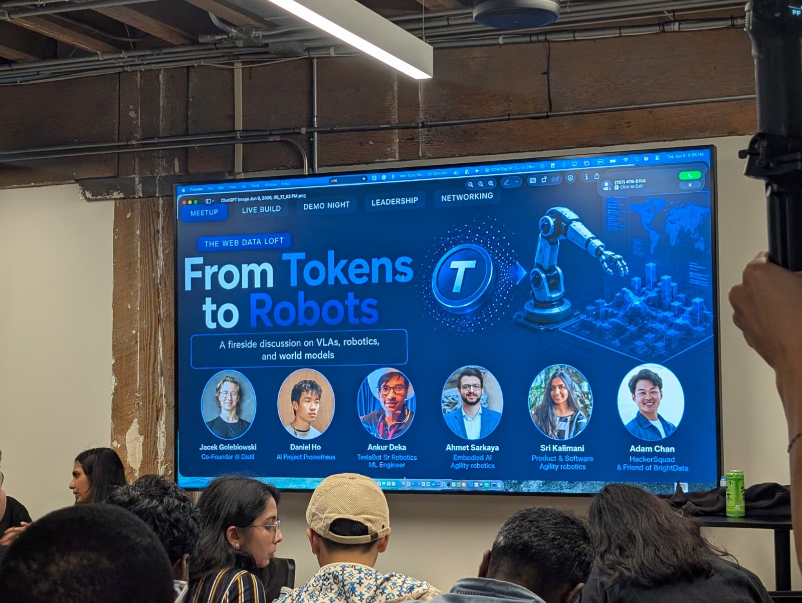
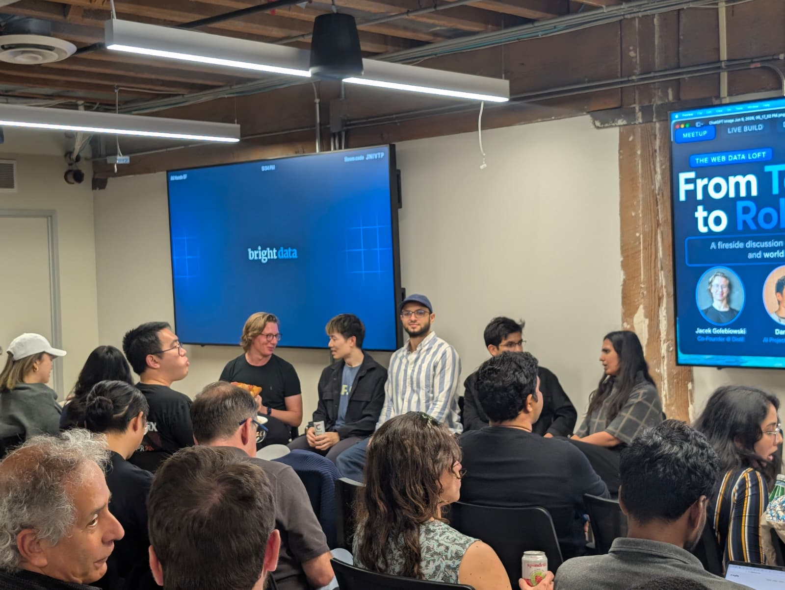


Panelist at a fireside discussion on **VLAs, robotics, and world models**, hosted by [Bright Data](https://brightdata.com) in San Francisco. We explored what it actually takes to build systems that can see, understand, and act.


[Event page](https://luma.com/vla-night-panel)

## About the event

**From Tokens to Robots** was a fireside chat and capability showcase on how developers and researchers can use web-scale data to power the next generation of vision, multimodal, and robotics applications.

Rather than a hands-on workshop, the session focused on the landscape, example implementations, and how these systems are actually built — with concrete examples of how web data can support multimodal workflows.

**625 2nd St, San Francisco, CA**

## Panel

- **Jacek Golebiowski**
- **Daniel Ho**
- **Ankur Deka**
- **Ahmet Sarkaya**
- **Sri Kalimani**

## What we covered

- How **web data fits into VLA, multimodal, and robotics workflows**
- The kinds of **datasets, pipelines, and infrastructure** needed to support these systems
- Real use cases and demos showing what these capabilities can unlock
- How teams are approaching **data collection, structuring, and downstream model workflows**

## Event photos




