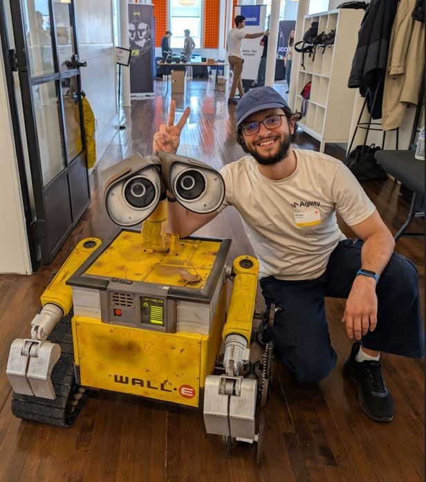
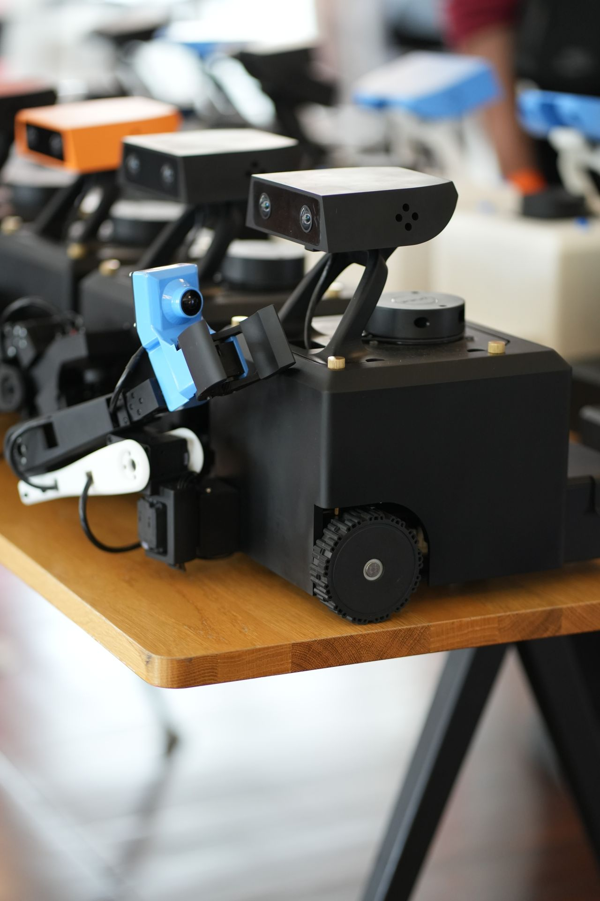
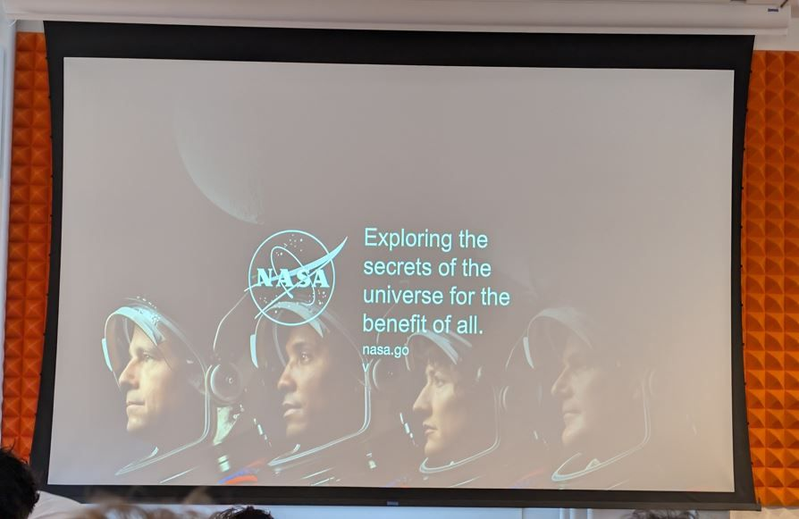
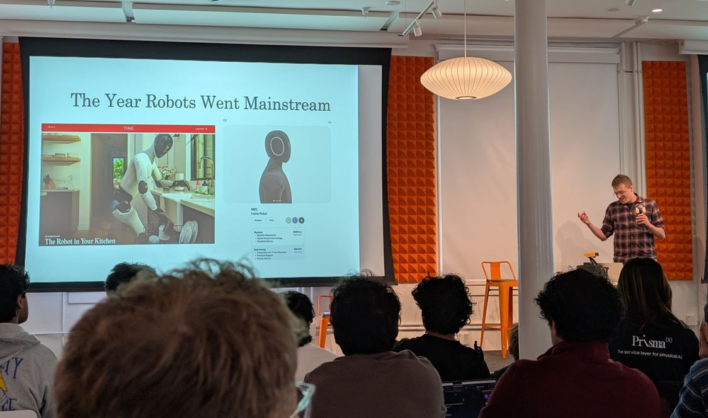


I had a fantastic time serving as a **mentor** at Y Combinator's RoboHacks, hosted by [Innate](https://innate.bot). The energy was incredible — 120 builders hacking on 25 MARS robots over one weekend at the YC office in San Francisco.


[Event page](https://luma.com/robohacks-at-YC)

## About the event

RoboHacks was the first robotics hackathon at the Y Combinator office — one weekend to build applications on a **general-purpose robot** across manipulation, navigation, and interaction.

Hosted by **Innate (YC F24)**, **Iterate**, **DeepMind**, **Scale AI**, and others, the event brought together 120 builders using 25 MARS robots. Prizes included $15k+ in cash, credits, robots, and guaranteed YC interviews.

**April 11–12, 2026**

- **Day 1 (9 AM–late):** Kickoff, hacking, mentorship
- **Day 2 (until 7 PM):** Final builds, demos, judging, awards

## Highlights

A huge highlight was hearing keynote insights from **Kevin Murphy** (NASA Chief AI Officer) and **Chris Paxton**. Sessions like these remind me why the robotics community is such an exciting place to be right now.

## Event photos




